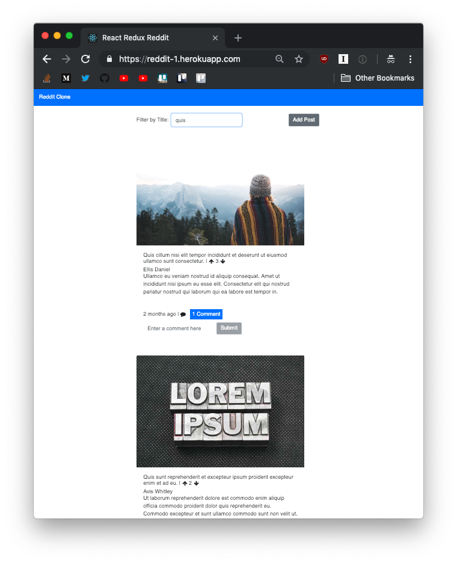
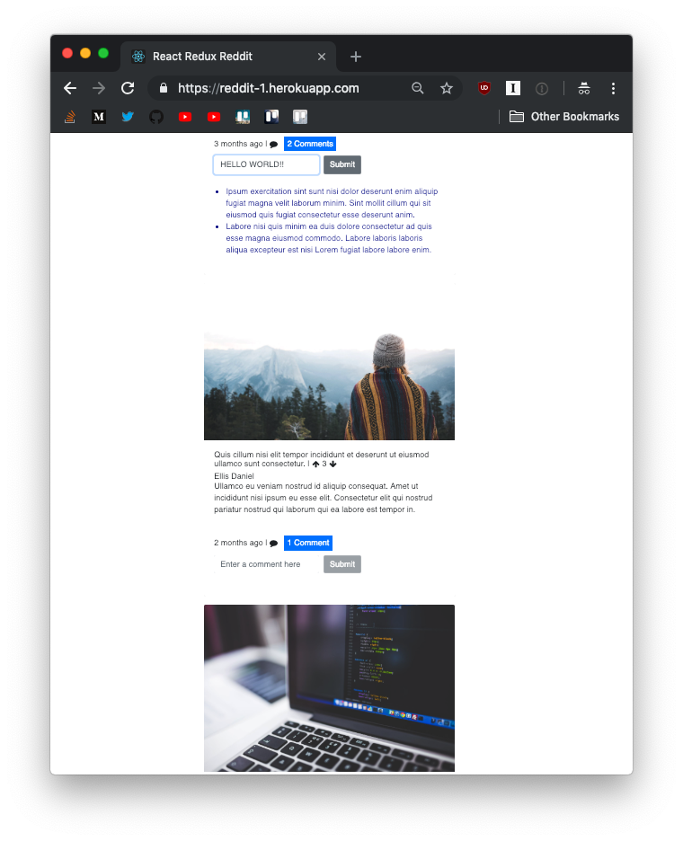
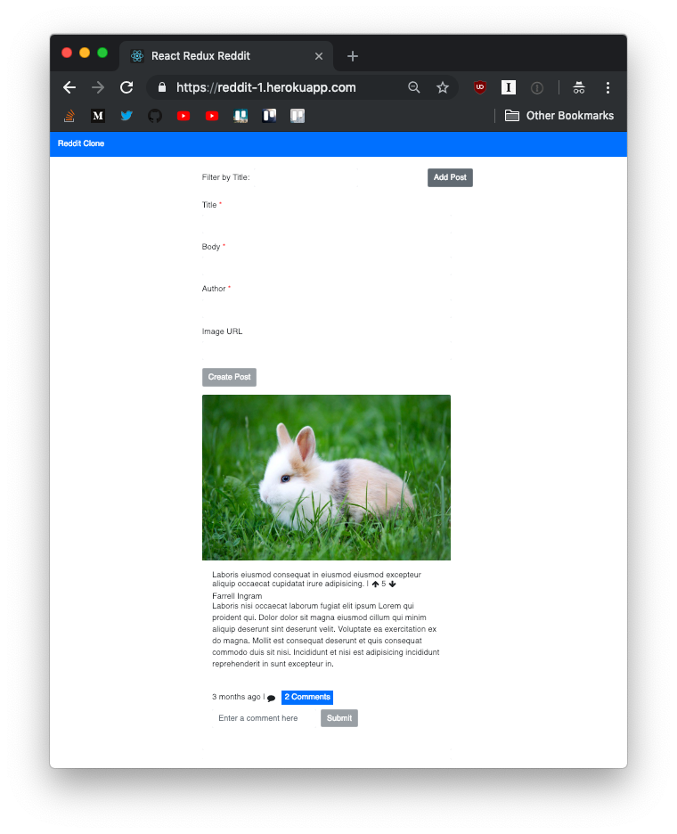

# React Redux Reddit

## Description
Reddit clone that stores data in-memory using an [API](https://github.com/JBallin/g-api) provided by Galvanize (with some modifications). I was given the basic structure and seed data but otherwise built everything on my own.

## Screenshots
##### Filter by Title

##### Add Comment

##### New Post


## Usage
```shell
$ npm install
$ npm start
```
Note: [API](https://github.com/JBallin/g-api) must be running as well.

## External API's
Backend uses the [Unsplash API](https://unsplash.com/developers) to generate a URL for a random photo if you don't include one when creating a post.
